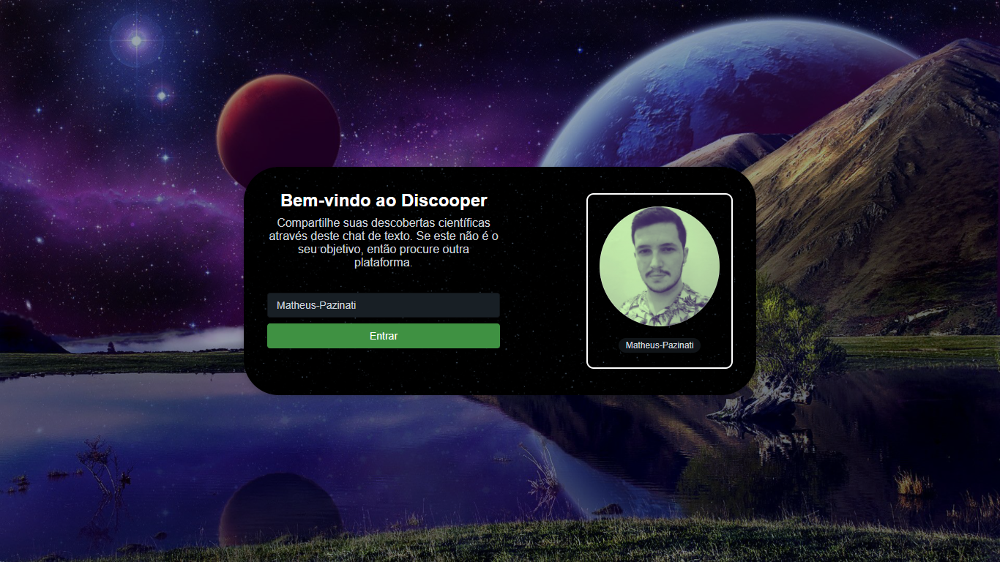

<h1 align="center">Discooper</h1>

  

 
<h2>🗣️ Sobre</h2>

Projeto construído durante a Imersão React da Alura. O Discooper é uma plataforma para troca de mensagens em tempo real, similar ao Discord, que possui como tema a série de televisão norte-americana The Big Bang Theory. Você pode acessar a plataforma do Discooper através deste link: <a href="https://discooper-imersao-react.vercel.app/">Discooper</a>

 
<h2>🎯 Objetivo</h2>

Este é o meu primeiro projeto utilizando a biblioteca/framework React, portanto, meu objetivo foi entender como esse framework funciona e suas particularidades (JSX, CSS in JS, Hooks), qual problema ele resolve (Performance, Manipulação do DOM, Reaproveitamento de código), e de que forma ele resolve (Virtual DOM, Componentização). Além disso, durante o desenvolvimento do projeto, foi possível identificar quais <i>features</i> do Javascript ele mais utiliza (Callback, Métodos de Arrays, Spread, Destructuring, Funções assíncronas), e identificando isto, pude realizar um plano de estudos intensivo em cima destes recursos, potencializando o meu entendimento sobre como o React funciona.

 
<h2>🛠️ Tecnologias e ferramentas/bibliotecas utilizadas</h2>
<ul>
  <li><a href="https://pt-br.reactjs.org/">React</a></li>
  <li><a href="https://nextjs.org/">NextJS</a></li>
  <li><a href="https://skynexui.dev/">SkynexUI</a></li>
  <li><a href="https://supabase.com/">Supabase</a></li>
  <li><a href="https://sweetalert2.github.io/">SweetAlert</a></li>
</ul>
 
<h2>📌 Funcionalidades a serem implementadas</h2>
<ul>
  <li>Permitir login apenas para usuários cadastrados no Github - Ok ✔️</li>
  <li>Botão para enviar mensagens (alternativa ao uso da tecla Enter) - Ok ✔️</li>
  <li>Exibir imagem de User Not Found na tela de login, caso o usuário não seja encontrado - Ok ✔️</li>
  <li>Botão para permitir que o usuário delete suas mensagens - Ok ✔️</li>
  <li>Migrar o projeto para Typescript</li>
</ul>
 
<h2>🔖 Layout</h2>

Você pode visualizar o layout do projeto através deste link: <a href="https://www.figma.com/file/tVrOHnvNQJxp8znddhZoft/Imers%C3%A3o-React---Aluracord---Matrix-(Copy)?node-id=0%3A1">Layout do projeto</a>. É necessário possuir uma conta no <a href="https://figma.com">Figma</a> para acessá-lo.

 
 

Made by Matheus Pazinati 🛸
